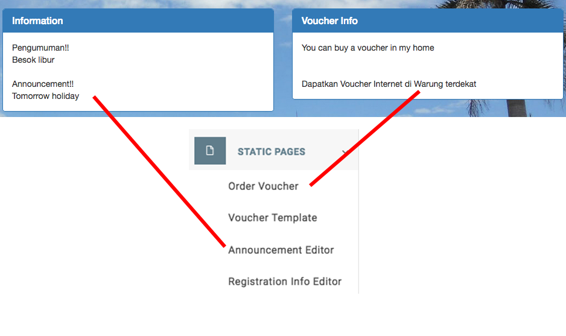

# Mikrotik Template Login para [NetBillX](https://github.com/freedarwuin/NetBillX)

---

## .:Español:.

Esta plantilla es para el inicio de sesión del Hotspot Mikrotik.  
Solo coloca todos los archivos dentro de la carpeta `hotspot` en Mikrotik y sobrescribe todo.  
Necesitas tener instalado [NetBillX](https://github.com/freedarwuin/NetBillX) en algún servidor.

### Pasos para configurar:

- Edita los siguientes archivos y busca **TODO** para seguir las instrucciones:
    - `login.html`
    - `status.html`
    - `logout.html`
- Elimina el archivo `errors.txt` y renombra `errors.en.txt` a `errors.txt`.
- Reemplaza el archivo `background.jpg` con tu propio fondo.
- Elimina la carpeta `remove`.

---

## ¡NO OLVIDES! 

Agrega la IP o dominio de tu servidor NetBillX al walled garden del hotspot.

Tambahkan alamat IP atau domain NetBillX server ke walled garden hotspot.

---

## Explicación 

---

## CRÉDITOS

Wallpaper de Masjid Agung Banten tomado de [www.bantenwisata.com](http://www.bantenwisata.com/2015/09/masjid-agung-banten.html)

Plantilla creada usando [Bootstrap v3.3.7](http://getbootstrap.com)